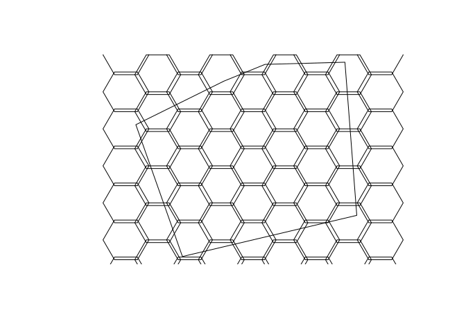
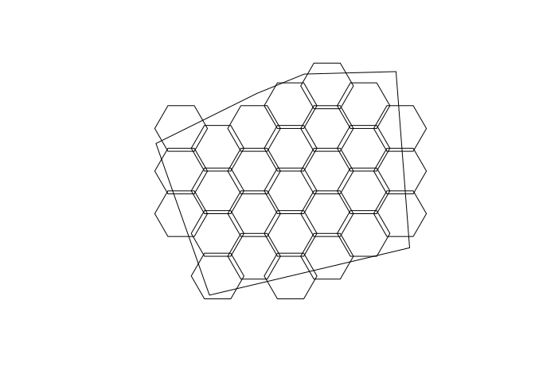

Tesis de licenciatura en Biología de Dahiana GuzmánDiseño, análisis.
================
true
julio 17, 2022

# Diseño de malla

Basado en: Batlle (2021)

``` r
# Crear cuadrícula para diseño de muestreo
library(dplyr)
```

    ## Warning: replacing previous import 'lifecycle::last_warnings' by
    ## 'rlang::last_warnings' when loading 'pillar'

    ## 
    ## Attaching package: 'dplyr'

    ## The following objects are masked from 'package:stats':
    ## 
    ##     filter, lag

    ## The following objects are masked from 'package:base':
    ## 
    ##     intersect, setdiff, setequal, union

``` r
library(sf)
```

    ## Linking to GEOS 3.10.1, GDAL 3.4.0, PROJ 8.2.0; sf_use_s2() is TRUE

``` r
construir_cuadricula <- T
```

``` r
parque <- st_read('data/limite-parque.gpkg') # Creada en QGIS, ver nota abajo
```

    ## Reading layer `limite-parque' from data source 
    ##   `/home/jose/Documentos/tesis-dahiana/tesis-licenciatura-biologia-uasd-/data/limite-parque.gpkg' 
    ##   using driver `GPKG'
    ## Simple feature collection with 1 feature and 1 field
    ## Geometry type: POLYGON
    ## Dimension:     XY
    ## Bounding box:  xmin: 402699.2 ymin: 2041878 xmax: 403116 ymax: 2042246
    ## Projected CRS: WGS 84 / UTM zone 19N

``` r
cuad <- st_read('data/cuadricula.gpkg')
```

    ## Reading layer `cuadricula' from data source 
    ##   `/home/jose/Documentos/tesis-dahiana/tesis-licenciatura-biologia-uasd-/data/cuadricula.gpkg' 
    ##   using driver `GPKG'
    ## Simple feature collection with 63 features and 5 fields
    ## Geometry type: POLYGON
    ## Dimension:     XY
    ## Bounding box:  xmin: 402637.3 ymin: 2041765 xmax: 403203.5 ymax: 2042297
    ## Projected CRS: WGS 84 / UTM zone 19N

``` r
plot(parque %>% st_geometry)
plot(cuad %>% st_geometry, add=T)
```

<!-- -->

``` r
cuad2 <- st_as_sf(cuad)
cuad2 <- cuad2 %>%
  mutate(
    ENLACE=1:nrow(cuad2),
    AREASQM1=st_area(geom) %>% units::drop_units())
cuad3 <- st_intersection(cuad2, parque %>% st_union) %>%
  mutate(AREASQM2=st_area(geom) %>% units::drop_units(),
         AREASQM_PCT=AREASQM2/AREASQM1*100)
```

    ## Warning: attribute variables are assumed to be spatially constant throughout all
    ## geometries

``` r
pct_eleg <- 40
cuad4 <- cuad2 %>%
  inner_join(
    cuad3 %>%
      filter(AREASQM_PCT >= pct_eleg) %>%
      st_drop_geometry() %>%
      select(ENLACE, AREASQM2, AREASQM_PCT))
```

    ## Joining, by = "ENLACE"

``` r
cuad4$ENLACE <- 1:nrow(cuad4)
cuad4$ENLACE
```

    ##  [1]  1  2  3  4  5  6  7  8  9 10 11 12 13 14 15 16 17 18 19 20 21 22 23 24 25
    ## [26] 26 27 28

``` r
cuad_final <- cuad4
names(cuad_final)[grepl('^geom$', names(cuad_final))] <- "geometry"
st_geometry(cuad_final) <- "geometry"
cuad_final
```

    ## Simple feature collection with 28 features and 9 fields
    ## Geometry type: POLYGON
    ## Dimension:     XY
    ## Bounding box:  xmin: 402697.2 ymin: 2041872 xmax: 403143.5 ymax: 2042260
    ## Projected CRS: WGS 84 / UTM zone 19N
    ## First 10 features:
    ##    id     left     top    right  bottom ENLACE AREASQM1 AREASQM2 AREASQM_PCT
    ## 1   9 402697.2 2042190 402783.8 2042115      1 4871.393 2158.696    44.31373
    ## 2  10 402697.2 2042120 402783.8 2042045      2 4871.393 4182.277    85.85383
    ## 3  11 402697.2 2042050 402783.8 2041975      3 4871.393 2485.221    51.01664
    ## 4  17 402757.2 2042157 402843.8 2042082      4 4871.393 4871.393   100.00000
    ## 5  18 402757.2 2042087 402843.8 2042012      5 4871.393 4871.393   100.00000
    ## 6  19 402757.2 2042017 402843.8 2041942      6 4871.393 4871.393   100.00000
    ## 7  20 402757.2 2041947 402843.8 2041872      7 4871.393 3710.643    76.17212
    ## 8  23 402817.1 2042190 402903.7 2042115      8 4871.393 4871.393   100.00000
    ## 9  24 402817.1 2042120 402903.7 2042045      9 4871.393 4871.393   100.00000
    ## 10 25 402817.1 2042050 402903.7 2041975     10 4871.393 4871.393   100.00000
    ##                          geometry
    ## 1  POLYGON ((402697.2 2042152,...
    ## 2  POLYGON ((402697.2 2042082,...
    ## 3  POLYGON ((402697.2 2042012,...
    ## 4  POLYGON ((402757.2 2042120,...
    ## 5  POLYGON ((402757.2 2042050,...
    ## 6  POLYGON ((402757.2 2041980,...
    ## 7  POLYGON ((402757.2 2041910,...
    ## 8  POLYGON ((402817.1 2042152,...
    ## 9  POLYGON ((402817.1 2042082,...
    ## 10 POLYGON ((402817.1 2042012,...

``` r
cuad_final <- cuad_final %>% rename(a0_square_meters = AREASQM1)
plot(parque %>% st_geometry)
plot(cuad_final %>% st_geometry, add=T)
```

<!-- -->

``` r
# st_write(cuad_final, 'data/cuadricula-final.gpkg')
```

# Referencias

<div id="refs" class="references csl-bib-body hanging-indent"
line-spacing="2">

<div id="ref-jose_ramon_martinez_batlle_2021_5694017" class="csl-entry">

Batlle, J. R. M. (2021). <span
class="nocase">geofis/forest-loss-fire-reproducible: First
release</span> (Version v0.0.0.9000).
<https://doi.org/10.5281/zenodo.5694017>

</div>

</div>
